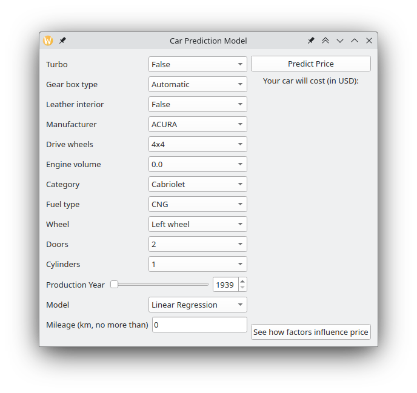
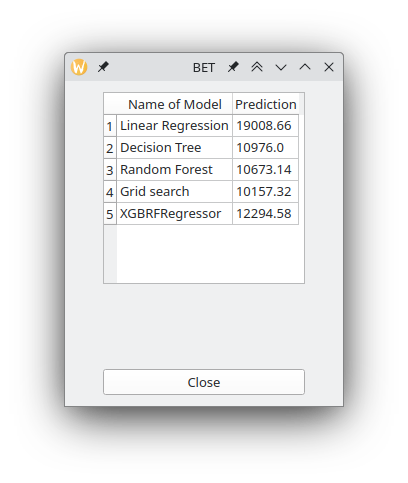
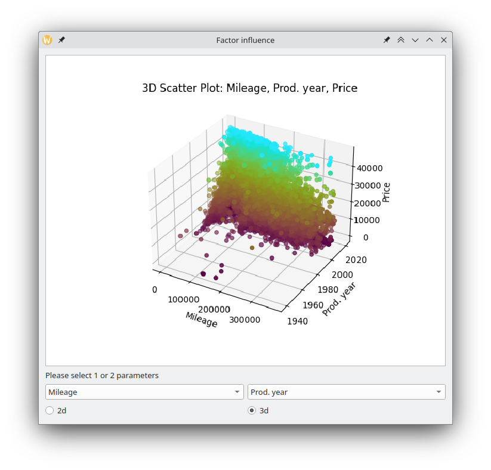
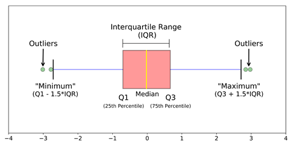
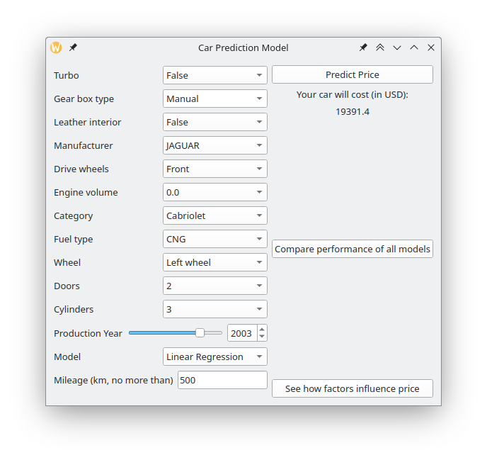
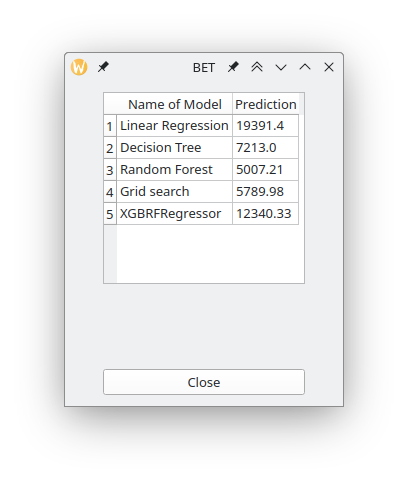
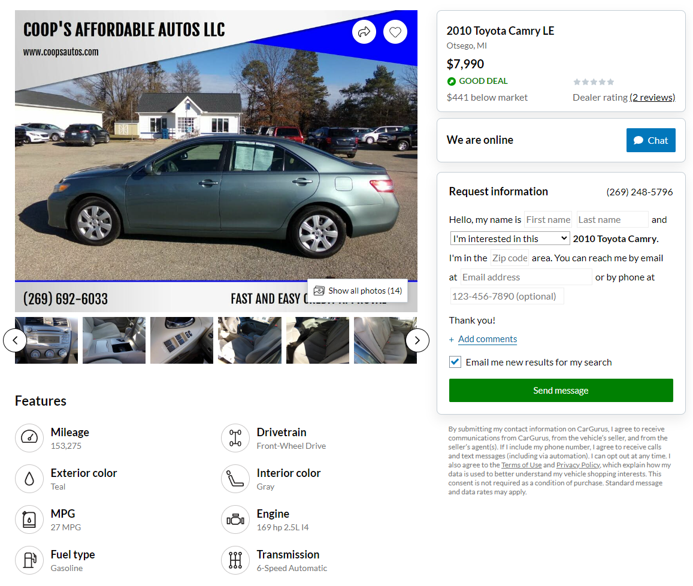
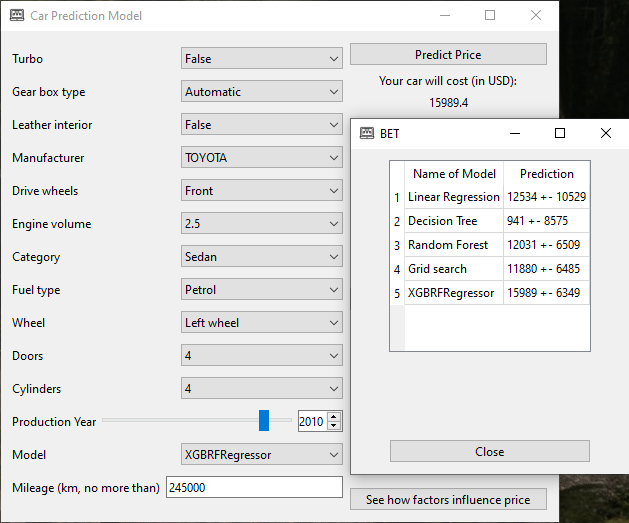
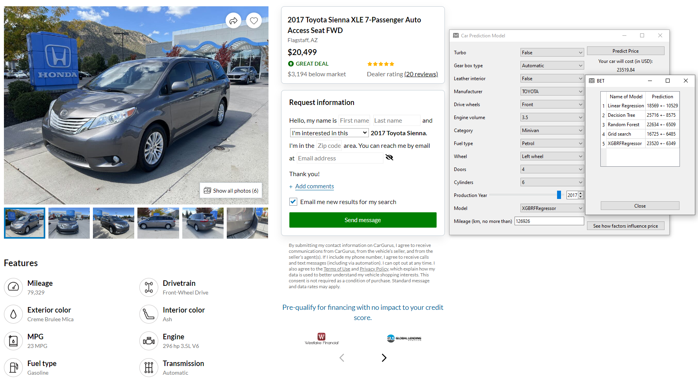

# QT car price prediction model

Be aware, that due to windows-related dll issues project may have troubles launching under windows machines. If you experience them, I recommend you to try project in VM (opensuse or ubuntu). Be sure to have [python-3.11.6](https://www.python.org/downloads/release/python-3116/)

## Authors

Maxim Lapitan 22200839

Maxim Zotov 22200849

[Link to MyGit repo](https://mygit.th-deg.de/mz20849/mm-recommendation)

## Project description

Project aims to predict price of the car based on criteria like mileage, volume of the engine, type of gearbox and so on.

Project uses openly distributed dataset from [Kaggle](https://www.kaggle.com/datasets/deepcontractor/car-price-prediction-challenge).

The dataset itself was modified and normalized, thus we use [our version](car_price_prediction.csv), which is added directly to repository.

Keep in mind, that project is writte using `*.ui` files in QT Designer. And is divided to 3 separate windows:

<p align="center">
  <figure>
    
    <figcaption>Main <code>form.ui</code></figcaption>
  </figure><figure>
    
    <figcaption>Model comparison <code> CompareModels.ui</code> </figcaption>
  </figure><figure>
    
    <figcaption>Influence of factor at price <code>influence.ui</code> </figcaption>
  </figure>
</p>


## Installation

There are several steps of installation, which have to be read carefully.

Software version used:

| Name         | Version |
| ------------ | ------- |
| python       | 3.11.6  |
| matplotlib   | 3.8.2   |
| PyQt6        | 6.4.2   |
| PySide6      | 6.6.0   |
| scikit-learn | 1.3.2   |
| seaborn      | 0.13.0  |
| xgboost      | 2.0.2   |

### Install all dependencies and activate venv

   ```bash
   git clone https://mygit.th-deg.de/mz20849/mm-recommendation.git
   cd mm-recommendation/
   python3.11 -m venv recomendation-venv
   source recomendation-venv/bin/activate
   pip install -r requirements.txt
   ```

### Get weights.

There are 2 options:

1. You can either train them yourself by running provided jupyter notebook `inspect_csv.ipynb`. This will also help you to understand project better
2. Or you can download them by running `download_and_init.py` script, which will download pretrained weights from nextcloud
   
### Run project. 

There are 2 options:

1. Via [QT Creator](https://www.qt.io/download). Open `recomendation.pyproject` as project in QT Creator and press either `Ctrl+R` or build symbol to build and run project. Please be sure to select `recomendation-venv` python binary as executable in Projects-Run in QT creator
2. Using using terminal and `pyside` commands. Activate previously created venv (if not done before) and type

```bash
pyside6-uic form.ui -o ui_form.py
pyside6-uic CompareModels.ui -o ui_CompareModels.py
pyside6-uic influence.ui -o ui_influence.py
```

After that you can run project `python main.py`

Be sure to have a look at [our jupyter notebook](inspect_csv.ipynb) to get familiar with project and its structure.

## Data analysis

Data analysis is done exclusively in [jupyter notebook](inspect_csv.ipynb) to prevent interface cluttering with a lot of nonessential information. Please consult [inspect_csv.ipynb](inspect_csv.ipynb) file to get to know our project and our approach better.

### Attributes of dataset
- Attributes
- ID: integer that numeretes data **(int)**
- Price: price of the care (Target Column) **(int)**
- Levy: tax related term. Tax of importing and exporting the cars **(int)**
- Manufacturer: company that produces cars **(text)**
- Model: model of the produced car by manufacturer **(text)**
- Prod. year: production year of the car **(int)**
- Category: jeep, sedan, cabriolet, hatchback, microbus, goods wagon, universal, coupe, limousine, minivan, pickup **(text)**
- Leather interior: shows if interior of the car is made of leather **(boolean)**
- Fuel type: hybrid, petrol, diesel, CNG (compressed natural gas), plug-in hybrid, LPG (liquefied petroleum gas), hydrogen **(text)**
- Engine volume: from 0.0 to 7.3 (shows how many litres are inside the engine) **(float)**
- Mileage: how much car has been driven in km **(int)**
- Cylinders: amount of cylinders inside the engine **(int)**
- Gear box type: automatic, manual, tiptronic, variator **(text)**
- Drive wheels: 4x4, rear or front, shows if only front wheels are driving wheels either it is rear or all 4 wheels drive the car. **(text)**
- Doors: number of doors in car (trunk does not count) **(text)**
- Wheel: left wheel or right-hand drive, shows if steering wheel is located left side of the car or right **(text)**
- Color: different color of the car body **(text)**
- Airbags: amount of airbags inside the car, from 0 to 16 **(int)**
- Turbo: shows if turbo is installed inside the engine (to power up the car) **(boolean)**

Short synopsis of what was done:

* Data source from [Kaggle](https://www.kaggle.com/datasets/deepcontractor/car-price-prediction-challenge) was downloaded and edited by hand (to remove anomal values that might break machine learning and pandas). Final file is stored in the root of the project [car_price_prediction.csv](car_price_prediction.csv).
* Edited file was inserted into jupyter notebook, where it was cleaned from outliers (to prevent model from overfitting to these values). Method used is shown on the picture below 
* After that data has been split to cathegorical and numerical and plotted accordingly in order to see cars distribution in the dataset.
* After that we tried to plot correlation between each feature with the price of a vehicle.
* Finally, correlation matrix was plotted to check if some cathegories affect other. Here we are mostly interested in correlation with price.
* Next comes training phase.
* Cathegorical features have to be converted into numbers. Thus we used `sklearn.preprocessing.LabelEncoder`. Because we will need to use our model in another project, `transform_dict` mapping was created, so `LabelEncoder` labels are preserved. It looks like this:

  ```json
  {'Manufacturer': {'ACURA': 0,
  'ALFA ROMEO': 1,
  'AUDI': 2,
  'BMW': 3,
  'BUICK': 4,
  'CADILLAC': 5,
  'CHEVROLET': 6,
  'CHRYSLER': 7,
  'CITROEN': 8,
   ........},
   'Leather interior': {False: 0, True: 1},
   'Fuel type': {'CNG': 0,
   'Diesel': 1,
   ........},
   'Gear box type': {'Automatic': 0, 'Manual': 1, 'Tiptronic': 2, 'Variator': 3},
   ........}
  ```

* After that we scaled our data using `sklearn.preprocessing.StandardScaler`, so that neither of weights have more influence just because of value ranges.
* Finally, the training begins. In our case we studied and implemented 5 regression models:
  * [LinearRegression](https://scikit-learn.org/stable/modules/generated/sklearn.linear_model.LinearRegression.html)
  * [DecisionTreeRegressor](https://scikit-learn.org/stable/modules/generated/sklearn.tree.DecisionTreeRegressor.html)
  * [RandomForestRegressor](https://scikit-learn.org/stable/modules/generated/sklearn.ensemble.RandomForestRegressor.html)
  * [GridSearchCV](https://scikit-learn.org/stable/modules/generated/sklearn.model_selection.GridSearchCV.html)
  * [XGBRFRegressor](https://xgboost.readthedocs.io/en/stable/python/python_api.html#module-xgboost.sklearn)

## Basic usage

Prior to running `main.py` make sure to fullfill prerequisites (see [this](#get-weights)), namely: 

* Either run jupyter notebook fully (better to run jupyter) or
* launch `download_and_init.py` to downloaded weights, that are needed for program to run

After folder `weights_variables` is populated with content, you can proceed to `main.py`.

You will be greeted by a starting gui 


Here you can select options like Turbo, Manufacturer via `QComboBox`, set a year with help of `QSlider` and `QSpinBox`, input Mileage using `QLineEdit`.

Additionally you can select from one of 5 [abovementioned models](#data-analysis) and click predict button.

This is an example what could happen.



After Predict Price button was clicked, *Compare performance of all models* button appears. On click, opens form, which uses all 5 pre-trained models to predict price.



Here we can see how different models predict price differently.

Finally, you can press "See how factors influence price" and play around with graphs and plots. 2d/3d switch switches between price dependancy on one or 2 factors respecitely


## Implementation of the Requests

Requests are implemented to trained weights using `pickle` and `joblib` libraries.

## Little overview of performance

Let us show how our models are working. Here we would predict car prices based on existing used cars that we found in internet.

First car is toyota camry le that cost 8000 dollars.


Here is how our model predicted. The result is really close.


Second car is toyota sienna xle that cost 20500 dollars. The model predicted value that is so close to the real price. 


If we go and check average price on this website for this specific car, then it shows that it is really really close to the actual price.


## Work done

In general, the project about a recommendation system has the following parts:
- Graphical User Interface (GUI) with PyQt
- Visualization (with pandas and matplotlib)
- Data analysis with pandas and numpy
- scikit-learn

The project is done by 2 students. We divided our parts by following:

Maxim Zotov:

1) Graphical User Interface with PyQt
2) Visualization

Maxim Lapitan:
3) Pandas with Numpy 
4) Scikit-Learn

**Both**: General Python Programming.
